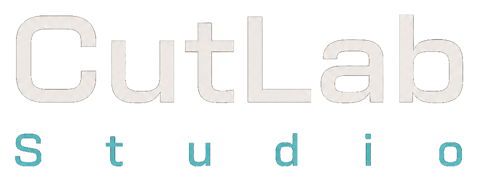
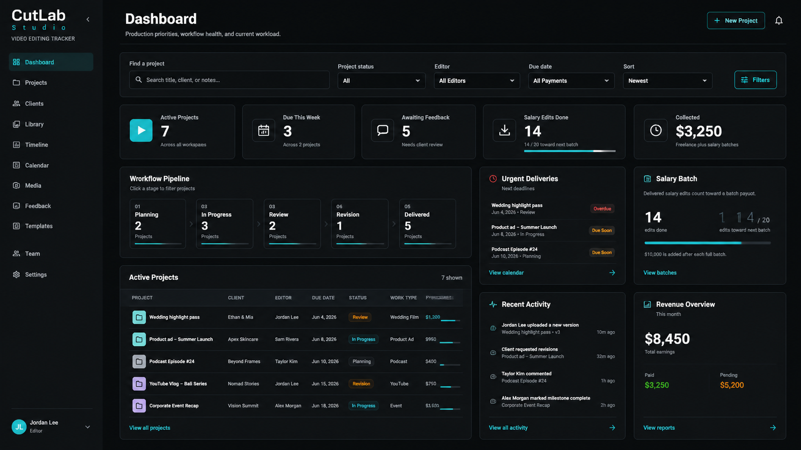
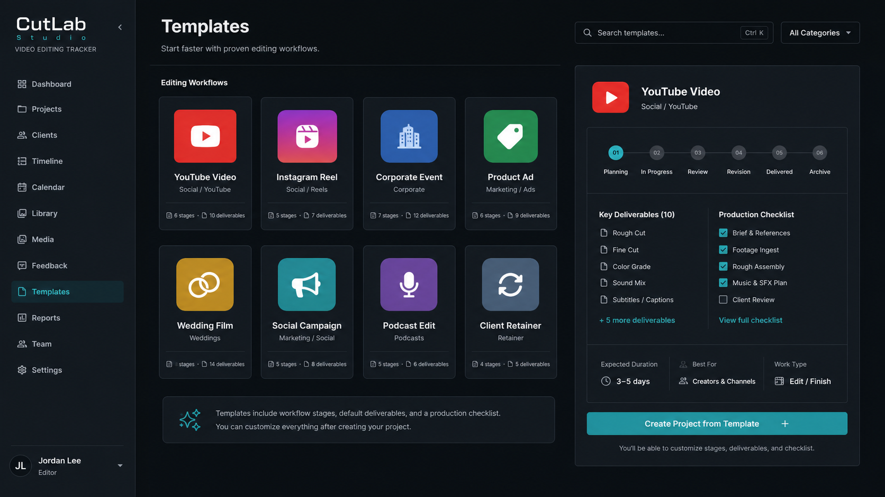
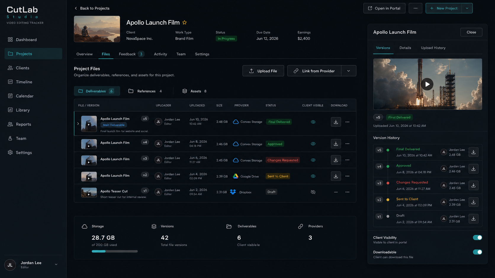
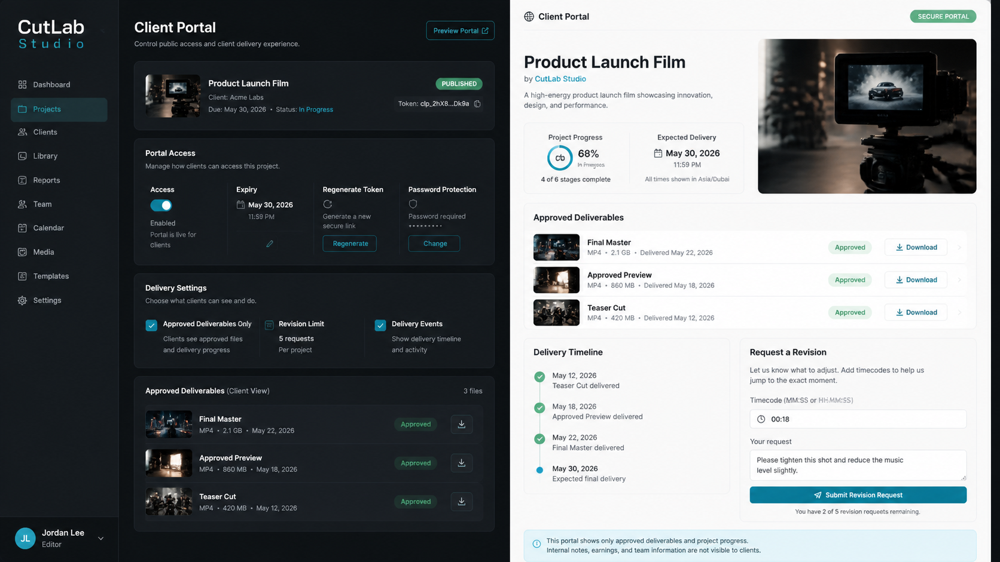
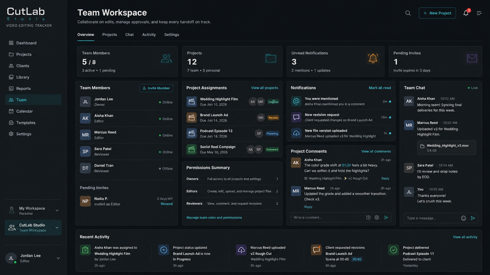
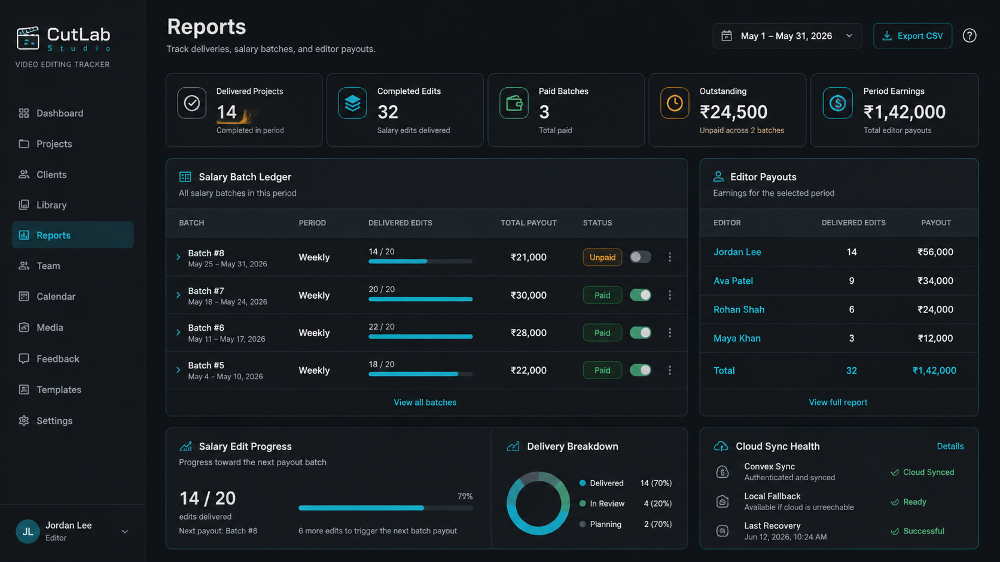
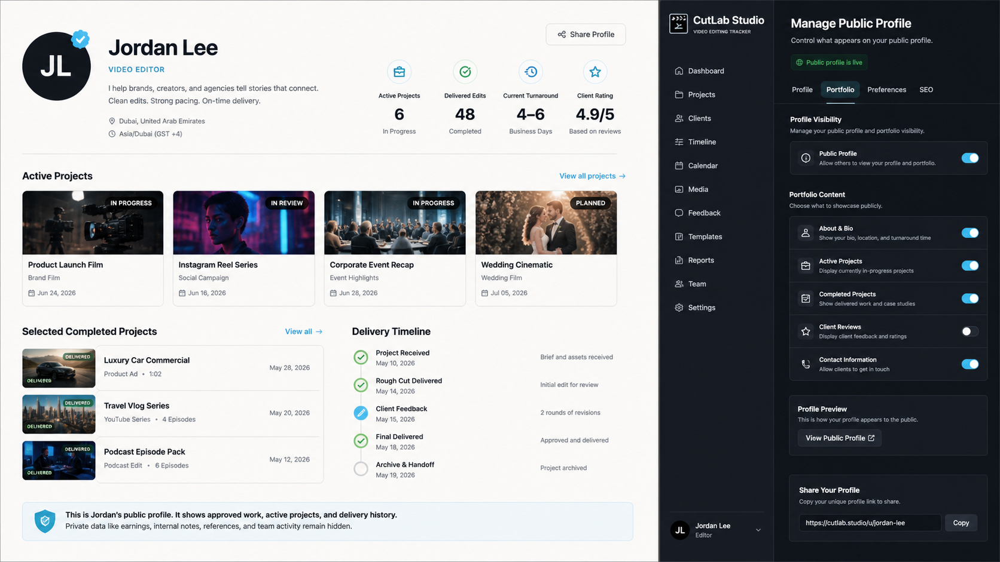
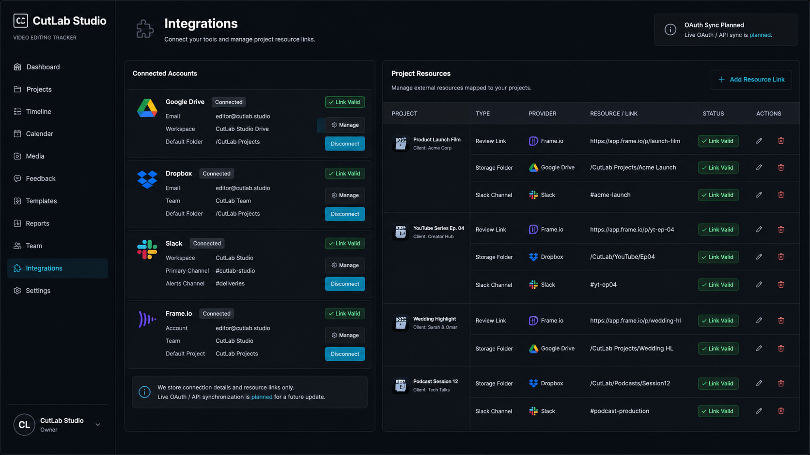

<p align="center">
  
</p>

<p align="center">
  <strong>A production command center for video editors and small creative teams.</strong>
</p>

<p align="center">
  Track edits, client deadlines, file versions, revision requests, salary batches, and team handoffs without turning your editing workflow into generic task-manager noise.
</p>

<p align="center">
  
  
  
  
  
  
</p>

---



## Why CutLab Exists

Most project tools treat video editing like generic task tracking. CutLab is narrower on purpose: projects have clients, due dates, deliverables, review rounds, assets, references, salary batches, and final exports.

CutLab Studio is built around that real production rhythm.

## Product At A Glance

- **Production command center** with compact metrics, workflow charts, deadlines,
  activity, collected earnings, and salary-batch progress.
- **Project operations** with personal and team workspaces, templates, statuses,
  priorities, assignments, due dates, notes, progress, and payout tracking.
- **Client delivery** with client records, secure no-account portals, approved
  downloads, delivery history, and timecoded revision requests.
- **Versioned media library** for deliverables, references, assets, external
  provider links, client visibility, and immutable upload history.
- **Team collaboration** with invitations, roles, assignments, mentions,
  comments, notifications, chat, and a shared activity trail.
- **Reports and payouts** with salary batches, editor totals, date filters,
  paid-state tracking, work-mix charts, and CSV export.
- **Editor identity** with public profiles, selected delivered work, turnaround
  details, portfolio metrics, and separate organization context.
- **Resilient cloud data** through Clerk-authenticated Convex sync with a local
  fallback that can recover when cloud authentication becomes available.

## Latest Product Changes

CutLab now uses a production-operations interface rather than a card-heavy
dashboard. The redesign is shared across Dashboard, Projects, Clients, Library,
Reports, Team, and Settings.

- Rebuilt the shell with grouped navigation, a compact account menu, clearer
  workspace identity, responsive behavior, and consistent light and dark modes.
- Replaced disconnected statistic cards with continuous metric rails, structured
  tables, split workspaces, status chips, and compact operational modules.
- Added real workflow and work-mix visualizations with MUI X Charts.
- Reworked Projects into a focused production index with personal and team views.
- Rebuilt Clients and Library as master-detail workspaces that keep context visible.
- Expanded Reports with salary batch reconciliation, editor payouts, collected
  earnings, period filtering, exports, and visual work distribution.
- Consolidated Settings into an indexed control surface for project rules,
  workflow stages, notifications, permissions, integrations, appearance, and
  regional preferences.
- Improved accessibility for labeled controls and colon-delimited timecode entry.
- Hardened Convex domain values with shared constants, strict validators where
  safe, and legacy normalization so existing records remain readable.
- Improved cloud initialization so a temporary auth failure can render local
  data without preventing a later successful Convex sync.
- Strengthened client-portal ordering, file-version status normalization,
  permission checks, verification scripts, and automated coverage.

## Visual Product Tour

The panels below are art-directed product visuals based on implemented CutLab
workflows. They present the feature story clearly for GitHub; exact interface
details may vary from the running build.

### See The Whole Production Picture


The dashboard brings active work, deadlines, feedback, workflow stages, salary
edit progress, earnings, and recent activity into one operational view.

### Start With An Editing Workflow



Eight built-in templates cover YouTube, reels, corporate events, product ads,
weddings, social campaigns, podcasts, and client retainers. Custom templates can
also be saved for recurring workflows. Each template prefills stages,
deliverables, checklists, work type, and expected duration.

### Keep Every Deliverable And Version Traceable



Deliverables, references, and assets share one versioned file model with upload
history, provider metadata, client visibility, download controls, and approval
states from Draft through Final Delivered.

### Deliver Through A Secure Client Portal



Editors can publish, disable, expire, regenerate, or password-protect a portal.
Clients see approved files, progress, delivery events, downloads, and timecoded
revision requests without receiving access to internal project data.

### Collaborate Without Mixing Personal And Team Work



Owners, Editors, and Reviewers work through server-enforced permissions,
assignments, mentions, timecoded comments, notifications, team chat, and a
shared activity trail while personal projects remain private.

### Track Editing Payouts Without Becoming Accounting Software



Reports connect delivered projects to salary batches, paid and outstanding
payouts, editor totals, date periods, and CSV exports. Cloud sync health and
local fallback status keep the operating state visible.

### Publish A Professional Editor Profile



Editors can share a public profile with bio, location, timezone, turnaround,
active work, selected delivered projects, and portfolio metrics while private
earnings, notes, references, and team activity stay inside the workspace.

### Keep External Resources Attached To The Project



Google Drive, Dropbox, Slack, and Frame.io connection details and project links
can be organized in CutLab today. Live OAuth, automatic file synchronization,
and message delivery remain explicitly modeled as future integration work. The
[third-party integration review](docs/security/THIRD_PARTY_INTEGRATION_REVIEW.md)
defines the trust gate for future OAuth, webhook, accounting, or payment work.

## Feature Status

| Feature | Status | Notes |
| --- | --- | --- |
| Production dashboard | Available | Surfaces delivery urgency, workflow distribution, feedback, earnings, salary batches, deadlines, and activity. |
| Personal and team projects | Available | Keeps solo projects separate from team-owned work while sharing one production index. |
| Project templates | Available | Eight editing workflows plus reusable custom templates prefill stages, deliverables, checklists, work type, and expected duration. |
| Client management | Available | Stores client contacts, project relationships, delivery context, and portal access. |
| Team workspaces | Available | Supports shared projects, roles, invitations, assignments, comments, activity, notifications, and chat. |
| Project file management | Available | Supports Convex Storage uploads, provider-neutral external links, client visibility, download controls, and typed approval states. |
| File version history | Available | Stores immutable uploaded or linked revisions with normalized status, file, provider, uploader, and timestamp metadata. |
| Cloudflare R2 storage | Upcoming | Prepared signed-upload path for large media files; current uploads remain on Convex Storage. |
| Client portals | Available | Provides no-account progress, approved downloads, delivery history, and timecoded revision requests through public links. |
| Portal access controls | Available | Editors can publish, unpublish, disable, expire, regenerate, or password-protect a portal. |
| Timecoded feedback | Available | Team comments and client revisions accept `MM:SS` and `HH:MM:SS` timestamps. |
| Production timeline | Available | Presents project milestones and delivery progress as a chronological production view. |
| Calendar | Available | Maps project due dates into a navigable delivery calendar. |
| Payout reports | Available | Shows salary batches, delivered projects, editor totals, work mix, paid status, period filters, and CSV export. |
| Salary batch tracking | Available | Reconciles delivered salary edits into configurable batches and tracks paid or outstanding payouts. |
| Public editor profiles | Available | Editors can publish a shareable profile page. |
| Appearance and density | Available | Supports light, dark, and system themes, accent selection, and comfortable or compact layouts. |
| Workspace settings | Available | Controls stages, defaults, permissions, notifications, appearance, and regional preferences. |
| Clerk authentication | Available | Clerk sign-in supplies authenticated identity to the app and Convex. |
| Convex sync | Available | Projects, settings, resources, payouts, teams, files, portals, and profiles sync through Convex with local fallback and recovery. |
| Google Drive integration | Modeled | Google Drive links and provider IDs are supported; OAuth and API synchronization are not implemented. |
| Dropbox integration | Modeled | Dropbox links and provider IDs are supported; OAuth and API synchronization are not implemented. |
| Slack integration | Modeled | Workspace and channel details can be stored; live message delivery is not implemented. |
| Frame.io integration | Modeled | Frame.io links and provider IDs are supported; OAuth and API synchronization are not implemented. |
| Invoice drafts | Available | Reports generate local invoice CSV drafts for unpaid delivered client projects; payment collection and accounting integrations are not implemented. |
| Client payment tracking | Available | Delivered billable projects can be marked paid/unpaid locally and sync through Convex. |
| Custom template builder | Available | Create, edit, delete, and reuse user-defined project templates from the Templates page and project start dialog. |

Planned work is outlined in the [CutLab Studio Roadmap](docs/product/ROADMAP.md).

## Demo

The [60-90 second product demo flow](docs/product/DEMO_FLOW.md) covers the full editor-to-client
story, including project setup, versioned delivery, a timecoded revision request,
final delivery, and the resulting dashboard update.

## Architecture Snapshot

| Layer | Stack |
| --- | --- |
| App framework | Next.js App Router |
| Interface | React 19, Material UI, MUI X Charts |
| Language | TypeScript |
| Auth | Clerk |
| Backend | Convex |
| Storage | Convex Storage plus provider-neutral external links; Cloudflare R2 upcoming |
| Local mode | Browser storage |
| Analytics | Vercel Analytics, Vercel Speed Insights |
| Tests | Vitest, `convex-test`, Playwright, route/runtime verifiers |

## Data Model Notes

- `projectFiles` represents the logical deliverable, reference, or asset.
- `projectFileVersions` stores each uploaded or linked revision.
- Shared domain constants and Convex validators constrain project, file, provider, role, member, revision, notification, and activity values.
- Legacy values are normalized at read boundaries so stricter validation does not strand existing records.
- Public portal queries return explicit client-safe projections.
- Server authorization always derives from the authenticated Convex identity.
- Team roles gate project and file mutations.
- Deleted projects clean up file versions, client portals, and project activity.

### Upcoming: Cloudflare R2 uploads

Cloudflare R2 support is prepared but intentionally parked. Current project
uploads use Convex Storage. When the R2 feature is released, Convex will remain
the owner of file metadata, authorization, version history, and portal
visibility while R2 stores binary objects behind short-lived signed URLs.

Do not set `NEXT_PUBLIC_FILE_STORAGE_PROVIDER=r2` or configure the R2 secrets
yet. The future setup will use `R2_ENDPOINT`, `R2_REGION`, `R2_ACCESS_KEY_ID`,
`R2_SECRET_ACCESS_KEY`, and `R2_BUCKET` in the Convex deployment environment.

The planned R2 bucket CORS policy is:

```json
[
  {
    "AllowedOrigins": ["http://localhost:3000", "https://your-cutlab-domain.example"],
    "AllowedMethods": ["PUT", "GET", "HEAD"],
    "AllowedHeaders": ["Content-Type"],
    "ExposeHeaders": ["ETag"],
    "MaxAgeSeconds": 3600
  }
]
```

Existing Convex Storage versions continue to work and are not migrated
automatically. Consider an R2 lifecycle rule for abandoned objects under
`projects/` if users can close the upload dialog after a successful PUT.

More detail lives in [Project File Architecture](docs/architecture/project-file-architecture.md).

## Quality Gates

This branch is validated with TypeScript, Convex tests, team-permission tests, production build checks, route verification, asset verification, and Convex development deployment.

Changes to the Convex-backed Team workspace should pass `npm run verify:team` and a live two-account Clerk/Convex smoke test using the checklist from `npm run verify:team:live`.

Current automated coverage includes:

- Team roles, invitations, project sync, comments, mentions, chat, and role migration.
- Project uploads, external providers, normalized version history, storage uniqueness, portal ordering, privacy, passwords, expiry, and revision limits.
- Local and authenticated cloud project workflows through Playwright.
- Timecode normalization, salary reconciliation, payout calculations, and CSV output through typed application logic.
- Route, link, metadata, screenshot asset, and source-invariant verification across the app.

The Convex-backed Team workspace has a static invariant check with
`npm run verify:team`. Authenticated realtime behavior is covered by the
`npm run verify:team:live` live two-account Clerk/Convex smoke test.

## Current State

CutLab Studio currently includes the redesigned production dashboard, separated
personal and team projects, client management, delivery timeline, calendar,
versioned media library, feedback queue, eight editing templates plus custom reusable templates, project file
and version management, secured client portals, timecoded feedback, team
collaboration, payout reporting, public profiles, indexed settings, responsive
light and dark themes, Clerk authentication, resilient Convex synchronization,
local guest mode, Vercel analytics, and end-to-end workflow coverage.

Client portal security currently includes enable/disable controls, optional expiry, token regeneration, and optional PBKDF2-hashed PIN/password protection. See [Security](docs/security/SECURITY.md) for the storage and access contract.

## Security

CutLab Studio uses Clerk authentication, identity-based Convex authorization, explicit client-safe portal projections, and baseline response headers. See the [Security Policy](docs/security/SECURITY.md) for implementation boundaries and private vulnerability reporting.

## Contributing

See [CONTRIBUTING.md](CONTRIBUTING.md) for setup, branch conventions, code expectations, and required checks before opening a pull request.

## License

License: Not specified yet.
