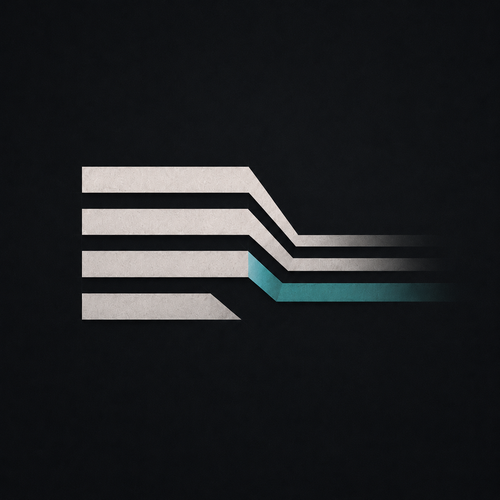

<p align="center">
  
</p>

<h1 align="center">Relay</h1>

<p align="center">
  A production workspace for freelance video editors and small post-production teams.
</p>

> [!WARNING]
> Relay is under active development. The data model, interface, setup steps, and hosted service may change without notice. Do not use the current build as the only copy of production data.

## What Relay does

Relay keeps video work in one workspace without reducing it to generic task tracking. A Project belongs to a Client, follows a reusable workflow, contains Project Outputs and Media Versions, and can publish a client-safe review portal.

The current build includes:

- A production dashboard with attention items, due dates, stages, recent activity, and money summaries.
- Client records, Project Groups, Projects, workflow templates, outputs, versions, files, and links.
- PIN-protected Client Portals with comments, review state, expiry, and access controls.
- Salary Plans, immutable Salary Batches, payment tracking, and reports.
- Calendar, Workspace-wide file discovery, and keyboard-first global search.
- Owner, Editor, and Viewer access with separate project, review, portal, and finance permissions.
- Light and dark themes, desktop and tablet layouts, and a mobile-ready Client Portal.

## Workspace modes

Relay supports three ways to enter the product:

| Mode | Storage | Intended use |
| --- | --- | --- |
| Local Mode | Browser storage | Solo work without an account. Export backups often. |
| Cloud Workspace | Convex | Signed-in sync, Team access, files, and Client Portals. |
| Sample Workspace | Read-only fixtures | Explore Relay without creating records. |

Local Mode does not sync across browsers or devices. Clearing site data can remove it. Use the backup tools in Settings before changing browsers or resetting local storage.

## Tech stack

- Next.js 16 and React 19
- TypeScript
- Convex
- Clerk
- Tailwind CSS and Radix UI
- TanStack Form and TanStack Table
- Vitest, `convex-test`, and Playwright
- OpenNext for Cloudflare Workers

## Run locally

Relay requires Node.js 22 or newer.

```bash
npm install
copy .env.example .env.local
npm run dev
```

On macOS or Linux, replace the `copy` command with:

```bash
cp .env.example .env.local
```

`npm run dev` starts Convex development and the Next.js app. Open [http://localhost:3000](http://localhost:3000).

For interface work that does not need a Convex process, run:

```bash
npm run dev:next
```

## Configuration

Copy `.env.example` and set the services you plan to use.

| Variable | Purpose |
| --- | --- |
| `NEXT_PUBLIC_CONVEX_URL` | Convex deployment used by the browser. |
| `NEXT_PUBLIC_CLERK_PUBLISHABLE_KEY` | Clerk browser key. |
| `CLERK_SECRET_KEY` | Clerk server key. |
| `CLERK_FRONTEND_API_URL` | Clerk issuer configured in the Convex deployment. |
| `ACCESS_WALL_PASSWORD` | Password for the private preview gate. |
| `NEXT_PUBLIC_SITE_URL` | Canonical site URL used by metadata and public links. |
| `RELAY_FILE_SIGNING_SECRET` | Convex secret used for signed file access. |

Cloud authentication needs matching Clerk and Convex configuration. A Clerk session alone does not grant Relay permissions if Convex cannot validate its token.

## Checks

Run the standard code checks:

```bash
npm run check
```

Run the full release suite:

```bash
npm run check:full
```

The full suite covers TypeScript, the production build, dependency audit, Relay and Convex tests, Chrome and Edge journeys, Firefox and WebKit smoke tests, and production route guards.

Useful focused commands:

```bash
npm run test:relay
npm run test:relay-cloud
npm run test:team
npm run test:files
npm run verify:browser
npm run verify:prod
```

Some authenticated browser tests need the Clerk and Convex test credentials described by the E2E environment loader. They skip when the linked test deployment cannot accept the configured account.

## Project status

Relay has completed its first full presentation cutover, but it is not a stable release. Current work includes hardening cloud authentication, testing real editor-to-client workflows, tightening responsive behavior, and checking storage and permission boundaries.

Expect unfinished copy, empty states, and small interaction changes while development continues. Issues and pull requests should describe the exact mode and route involved because Local Mode, Cloud Workspace, and Sample Workspace use different capabilities.

See the [Relay product brief](docs/product/RELAY_REBUILD_PRODUCT_BRIEF.md), [roadmap](docs/product/ROADMAP.md), and [architecture boundary](docs/architecture/relay-rebuild-boundary.md) for more detail.

## Deployment

Relay targets Cloudflare Workers through OpenNext.

```bash
npm run preview
```

The repository also contains deployment commands, but running them changes external state. Review the environment, secrets, Clerk issuer, and Convex target before using any deployment command.

## Security

Relay uses Clerk identity, Convex authorization, private file access, and explicit client-safe portal projections. Read [SECURITY.md](docs/security/SECURITY.md) before changing authentication, permissions, file delivery, or Client Portal behavior.

Do not report security issues in a public GitHub issue. Follow the private reporting instructions in the security policy.

## Contributing

Read [CONTRIBUTING.md](CONTRIBUTING.md) before opening a pull request. Keep changes focused, add tests for behavior changes, and run the relevant checks before requesting review.

## License

No license has been specified yet.
