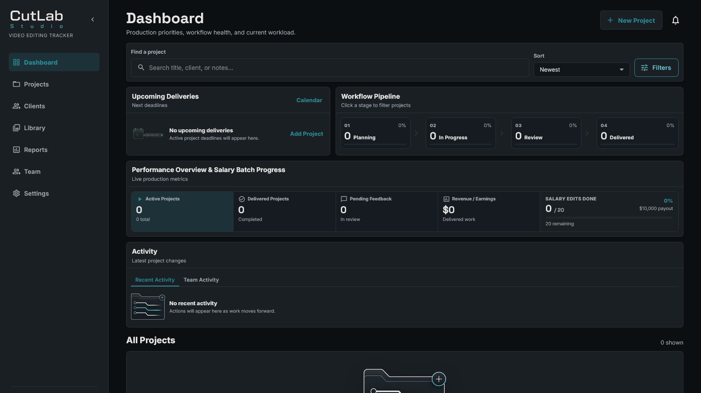
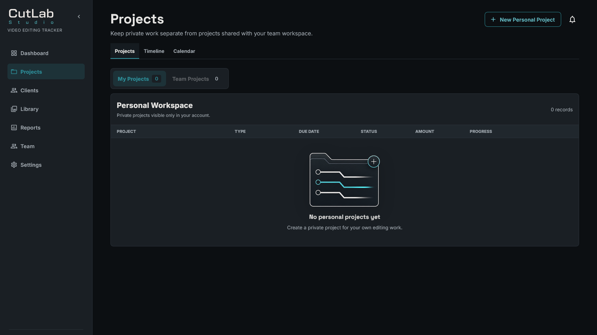
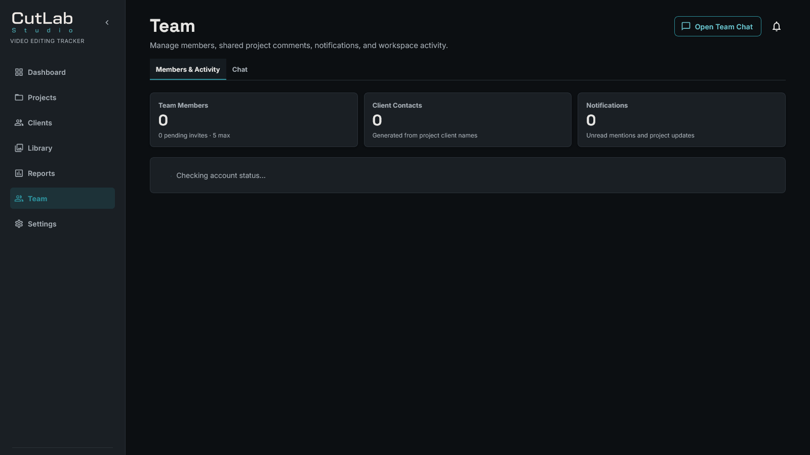

# CutLab Studio


CutLab Studio is a production workspace for video editors and small creative teams. It combines project tracking, deadlines, client delivery, revision handling, file versions, salary batches, reports, and collaboration in one focused application.

Users can create an account with Clerk and sync through Convex, or use the app locally without an account.

## Product Preview



The dashboard is a production command center rather than a generic project list. It surfaces upcoming deliveries, workflow stages, active work, pending feedback, earnings, salary-batch progress, and recent activity before the project table.

## Current Capabilities

### Production Management

- Command-center dashboard with workflow pipeline, delivery priorities, performance metrics, salary progress, and activity feeds.
- Personal and team project workspaces kept separate by design.
- Project creation, editing, deletion, filtering, sorting, status tracking, dates, clients, notes, tags, earnings, and assignments.
- Timeline and calendar views for delivery planning.
- Client, feedback, media, resources, templates, and reporting workflows.
- Responsive dark and light themes with configurable accent, density, date, time-zone, workflow, and notification settings.

### Project Files

Every project has a unified file workspace for:

- Deliverables
- Reference files
- Assets
- Upload history

Files use a logical-file and immutable-version model. Each version tracks its upload date, file size, uploader, provider, file name, MIME type, notes, and version number.

CutLab supports direct Convex file uploads and provider links. Google Drive and Frame.io identifiers already use the same provider-neutral version model, allowing future OAuth and API integrations without replacing project file records.

### Client Delivery

- Publish a unique, account-free client portal for a project.
- Share project progress, approved deliverables, downloads, revision limits, client-safe notes, and timeline events.
- Accept revision requests without exposing earnings, internal notes, team data, assets, or reference files.
- Control whether each deliverable is client-visible and downloadable.
- Maintain legacy portal links while new deliverables use the unified project file system.

### Accounts And Profiles

- Clerk sign-up and sign-in with username/email or GitHub.
- GitHub profile name and image support.
- Private account controls for email, password, security, and connected providers.
- Editable public editor profiles with unique shareable URLs, portfolio metrics, projects, bio, location, time zone, and turnaround.
- Organization profile and account-free local mode.

### Team Collaboration

- Small-team workspaces with Owner, Editor, and Reviewer permissions.
- Email invitations and invite-code joining.
- Shared team projects, assignments, comments, mentions, notifications, activity history, and team chat.
- Role-aware project and file access.
- Explicit separation between personal projects and team-owned projects.

## Workspace



Projects are organized into personal and team workspaces. Editors can move between Projects, Timeline, and Calendar through contextual navigation without filling the sidebar with one route per view.

## Collaboration



The team area centralizes membership, client contacts, notifications, shared-project activity, and chat while preserving role boundaries.

## Architecture

| Layer | Technology |
| --- | --- |
| Framework | Next.js App Router |
| UI | React 19, Material UI |
| Language | TypeScript |
| Authentication | Clerk |
| Realtime backend | Convex |
| File storage | Convex Storage plus provider-neutral external links |
| Local mode | Browser storage |
| Analytics | Vercel Analytics and Speed Insights |
| Testing | Vitest, `convex-test`, custom route/runtime verification |

Important implementation notes:

- Local mode does not require Clerk or Convex authentication.
- Signed-in data is synchronized through Convex.
- Authorization is derived from the authenticated identity on the server.
- Public portal queries return explicit client-safe projections.
- Project files and file versions are separate Convex tables.
- Deleting a project also removes its stored file versions, portal data, and project activity.

See [Project File Architecture](docs/project-file-architecture.md) for the file-provider and versioning model.

## Getting Started

Requires Node.js 22 or newer.

```bash
npm install
npm run dev
```

`npm run dev` starts Convex and Next.js together.

To run them separately:

```bash
npm run convex:dev
npm run dev:next
```

## Environment

The app can run locally without cloud services. Account-backed sync requires Clerk and Convex configuration in `.env.local`.

```bash
NEXT_PUBLIC_CLERK_PUBLISHABLE_KEY=
CLERK_SECRET_KEY=
NEXT_PUBLIC_CONVEX_URL=
CLERK_JWT_ISSUER_DOMAIN=
CLERK_FRONTEND_API_URL=
```

## Verification

```bash
npm run lint
npm run test:team
npm run test:files
npm run build
npm run verify
```

| Command | Purpose |
| --- | --- |
| `npm run lint` | TypeScript validation with `tsc --noEmit` |
| `npm run test:team` | Team roles, invitations, project sync, and collaboration tests |
| `npm run test:files` | Project files, uploads, version history, permissions, and portal projection tests |
| `npm run build` | Optimized Next.js production build |
| `npm run verify` | Route, link, asset, metadata, and source-invariant checks |
| `npm run verify:browser` | Production browser smoke checks |
| `npm run verify:prod` | Production server verification |
| `npm run check:full` | Complete CI-style verification path |

## Current Status

The application currently includes the production dashboard, personal and team projects, project file/version management, client portals, public profiles, account settings, consolidated navigation, branded empty states, Clerk authentication, Convex synchronization, Vercel analytics, and automated validation.

The fresh screenshots above are captured from the current local application UI.
